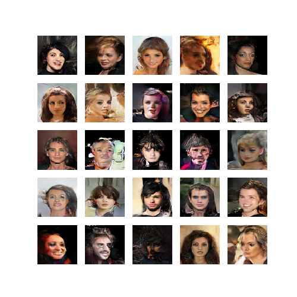
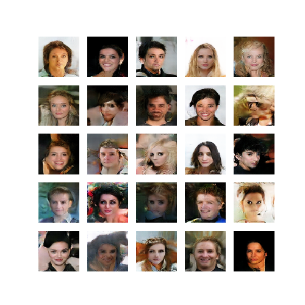

# FaceGAN
An implementation of GAN (generatove adverserial network) for generating face image.

## Inctroduction

This implementation ***is not*** for a specific paper, but introduces several techniques:
- Spectral normalization for generative adversarial networks

  original paper: https://arxiv.org/pdf/1802.05957

- The relativistic discriminator: a key element missing from standard GAN

  original paper: https://arxiv.org/pdf/1807.00734

## Dataset

CelebA: http://mmlab.ie.cuhk.edu.hk/projects/CelebA.html

path: ./datasets/img_align_celeba

## Results

Note that the following results have never been manually filtered, but completely generated by random input. 

